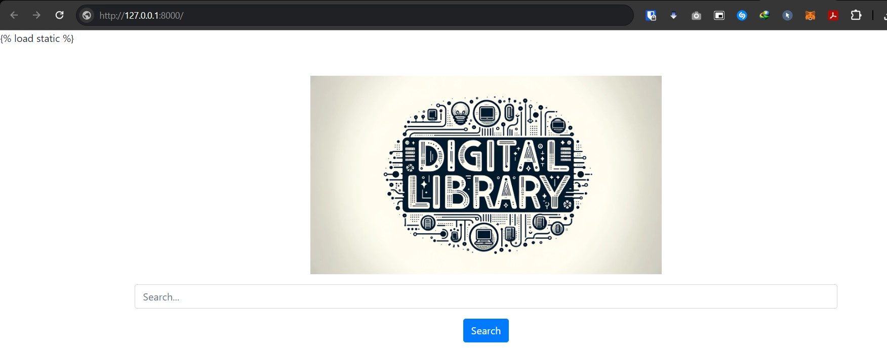

# Baseline Report
Digital Library

## Introduction

This report is a baseline report for the project. It is a starting point for the project and will be updated as the project progresses. The report will be updated with the following sections:

- Data
    - Dataset Source  
> arvix dataset - https://drive.google.com/uc?id=1b3rmCSIoh6VhD4HKWjI4HOW-cSwcwbeC&export=download  
File Contents--  
File: arxiv-dataset/ | Size: 0.00B  
File: arxiv-dataset/train.txt | Size: 13.29GB  
File: arxiv-dataset/vocab | Size: 2.34MB  
File: arxiv-dataset/test.txt | Size: 417.72MB  
File: arxiv-dataset/val.txt | Size: 417.00MB  

> pubmed dataset - https://drive.google.com/uc?id=1lvsqvsFi3W-pE1SqNZI0s8NR9rC1tsja&export=download  
File Contents--  
File: pubmed-dataset/ | Size: 0.00B  
File: pubmed-dataset/train.txt | Size: 4.13GB  
File: pubmed-dataset/vocab | Size: 654.72KB  
File: pubmed-dataset/test.txt | Size: 238.93MB  
File: pubmed-dataset/val.txt | Size: 239.72MB

- Data Preprocessing
    - Data Cleaning
    - Data Transformation
    - Data Reduction
    - Data Integration
    - Data Discretization
    - Data Normalization
    - Data Standardization
    - Data Encoding
    - Data Splitting
    - Data Augmentation
    - Data Balancing
    - Data Visualization
    - Data Summary

- Methodology

- Results

- Conclusion

