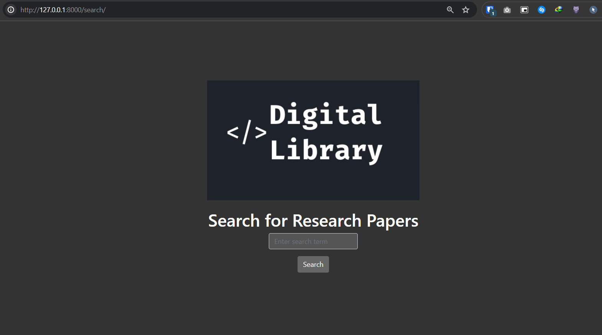

# how to setup the project
- clone the project
- create a virtual environment using `python -m venv venv`
- activate the virtual environment using `source venv/bin/activate`
- install the dependencies in requirements.txt using `pip install -r requirements.txt`

### Additional dependencies
- `pip install --upgrade google-cloud-aiplatform` 
    - add google account with vertex ai access to the project
    - install the google cloud sdk and authenticate the account
    - https://cloud.google.com/sdk/docs/install

- install other remaining dependencies

- run the project using python manage.py runserver
- open the browser and go to localhost:8000
- for initial run, many packages will be downloaded and installed like hugging face models and stuff
- If everything is setup correctly, you should see the home page of the project

